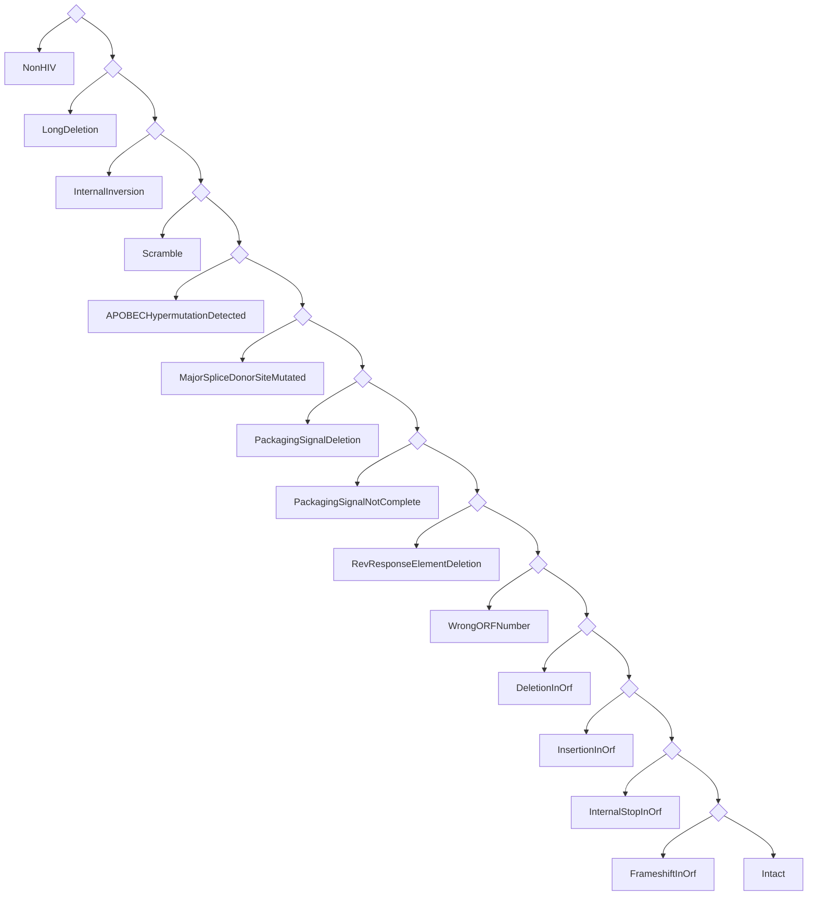

```mermaid
flowchart TD
    Q{ } --> W[NonHIV]
    Q{ } --> E{ }
    E --> R[LongDeletion]
    E --> T{ }
    T --> Y[InternalInversion]
    T --> U{ }
    U --> I[Scramble]
    U --> O{ }
    O --> P[APOBECHypermutationDetected]
    O --> A{ }
    A --> S[MajorSpliceDonorSiteMutated]
    A --> D{ }
    D --> F[PackagingSignalDeletion]
    D --> G{ }
    G --> J[PackagingSignalNotComplete]
    G --> K{ }
    K --> L[RevResponseElementDeletion]
    K --> Z{ }
    Z --> X[WrongORFNumber]
    Z --> C{ }
    C --> V[DeletionInOrf]
    C --> B{ }
    B --> N[InsertionInOrf]
    B --> M{ }
    M --> A1[InternalStopInOrf]
    M --> A2{ }
    A2 --> A3[FrameshiftInOrf]
    A2 --> A4[Intact]
```
