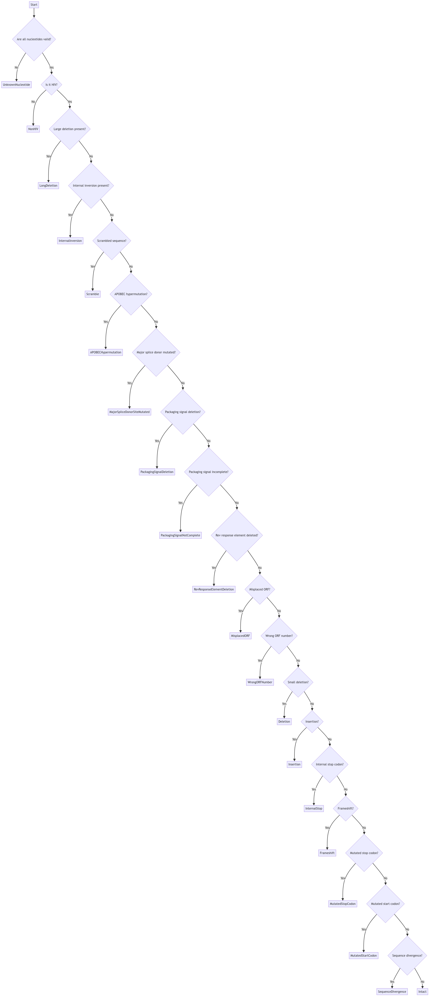

Proviral genomes can harbor several types of defects due to both natural viral evolution and technical factors encountered during the preparation and sequencing of samples. This page provides an overview of the various proviral defects flagged by the pipeline, explains their biological and technical meanings, and outlines how --- when more than one defect is present --- the pipeline prioritizes defects based on their perceived severity.

> Note: This is one of the last steps performed by the pipeline. For an overview of the entire workflow, please refer to the [High--Level Workflow](workflow.html) page.

---

# Defects in Proviral Genomes

During proviral sequence analysis, modules such as CFEIntact (or alternatively, HIVSeqinR) scan each sequence for abnormalities. These abnormalities, or defects, may result from:

- **Biological processes**:
  Natural mutation processes like APOBEC--induced hypermutation, replication errors, or recombination events that produce deletions or inversions.

- **Technical artifacts**:
  Issues with primer binding, low read coverage, or misassemblies introduced during PCR amplification and sequencing.

The pipeline reports a range of defects --- from subtle mutations to major structural dislocations --- to provide a holistic picture of the integrity of each proviral sequence.

---

# Types of Proviral Defects

The pipeline identifies several common defect types, such as:

- **Hypermutation**:
  Extensive alteration of the nucleotide sequence, often due to APOBEC enzymatic activity, which renders the provirus non-functional.

- **Long Deletion**:
  The loss of a large portion of the viral genome, potentially removing essential genes or regulatory regions.

- **Internal Inversion**:
  A segment of the genome being reversed in orientation, disrupting the normal gene order and expression patterns.

- **Scramble**:
  Disorganized or misassembled regions that may indicate errors in sequence assembly.

- **Packaging Signal Issues**:
  Defects in the sequences necessary for proper viral assembly, which can impact virion formation.

- **Splice Site Mutations**:
  Changes in key splice donor or acceptor sites, affecting RNA processing and the production of viral proteins.

- **Other Coding Anomalies**:
  Including frameshifts, premature stop codons, insertions, and other modifications that can lead to defective viral proteins.

For a complete list of recognized errors, refer to [CFEIntact's documentation](https://cfe-lab.github.io/CFEIntact/workflow.html).

---

# Severity Ranking and Defect Selection

While a single proviral genome may display multiple defects simultaneously, for summary reporting the pipeline designates one "most serious defect." This selection is guided by a predetermined severity ranking that reflects the biological and clinical importance of each defect type.

## How the Ranking Works

1. **Detection and Collection**:
   For every proviral sequence, the analysis modules generate a list of defect calls when abnormalities are detected. If no defects are found, the provirus is labeled as "Intact."

2. **Severity Ordering**:
   The pipeline defines an ordered list of defect codes where the order indicates increasing severity. For instance, defects such as **APOBECHypermutation** will be ranked higher than defects like **Frameshift** because hypermutation is considered to more comprehensively incapacitate the virus.

3. **Selection**:
   When multiple defects are present, the pipeline chooses the defect that appears first in the severity ranking list to represent the provirus's status. This "most serious defect" is then used in outcome summaries and downstream analyses.

Visually, the procedure looks like this:

> Note: this part describes CFEIntact's decision process. To learn about HIVSeqinR's one, study [it's introduction paper](https://www.nature.com/articles/s41467-019-10659-2).

---

# Example Case

Consider a proviral sequence that shows evidence of both **APOBECHypermutation** and **Frameshift**.
Given that the predefined ranking prioritizes **APOBECHypermutation**, the pipeline designates "Hypermutation" as the most serious defect. This result --- encoded in the summary (for example, in the `MyVerdict` field of the `table_precursor.csv`) --- provides a streamlined way to assess the overall quality of the provirus.

---

# Implications for Downstream Analysis

The assignment of a "most serious defect" has several important consequences:

- **Outcome Summaries**:
  The final output files (such as `outcome_summary.csv` and `table_precursor.csv`) use the selected defect label to summarize proviral quality and usability.

- **Visualization**:
  Landscape plots and other visual tools use the defect label for color--coding or flagging genome fragments. This immediate visual cue can help identify patterns or clusters of similar defect types across samples.

- **Biological and Clinical Interpretation**:
  Understanding varial defects can inform decisions regarding the provirus's potential for reactivation or its response to therapeutic interventions.

---

# Next steps

Browse [CFEIntact's documentation](https://cfe-lab.github.io/CFEIntact) for details on individual defect codes and the process of defect discovery.
