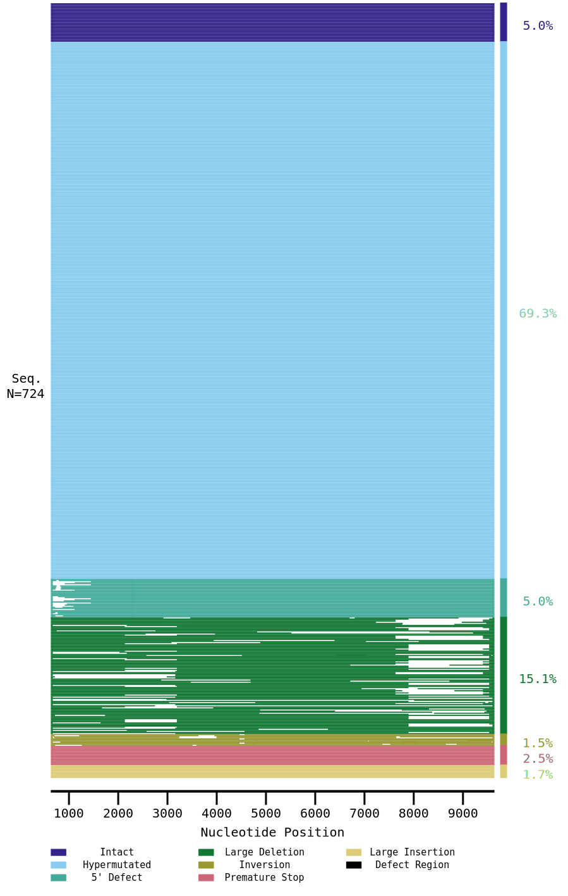

This document is intended to guide you through understanding and utilizing the output files produced by the proviral pipeline. Once the analysis has completed successfully, you will find several files in your working directory that summarize and detail different aspects of the processing. In this guide, we walk you through each output file, explain the information contained within, provide troubleshooting tips, and offer suggestions for further analysis.

The proviral pipeline produces a collection of output files that capture the status of sample processing from primer detection, alignment, gene splicing, and quality control. These files allow you to:

- Assess whether sample sequences passed quality control (QC)
- Determine reasons for sample failure or error
- Prepare data for downstream analysis and visualization
- Examine detailed log information in case troubleshooting is required

These output files are created in the current working directory, assuming that you followed [previous instructions](running_pipeline.html).
Most of them are of the spreadsheet format, which means that they can be opened with Excel or even Notepad.

---

# Output Files

Below is an explanation of each key output file:

## --- `outcome_summary.csv` ---

This file provides an overall summary for each sample.

#### Contents

This file includes columns such as `sample`, `run`, `passed`, `error`, `reference`, `seqlen`, `seqtype`, and additional fields reporting primer errors (if any). Here is what some columns mean:

- **sample**: Unique identifier of the sample.
- **run**: Run name (often derived from the input metadata).
- **passed**: Indicates if the sample's QC criteria have been met (`True`/`False`).
- **error**: A summarized error message if no valid sequence was identified. Possible error codes include:

  - `no contig/conseq constructed`
  - `sequence is non-hiv`
  - `primer error` (which may include sub--errors like `primer was not found`, `primer failed validation`, or `low end read coverage`)
  - `low coverage`
  - `multiple contigs`
  - `hiv but failed`

  For details on these refer to the [Error codes](errors.html) page.

- **reference**: reference sequence to which this sample was aligned.
- **seqlen**: length of the sample sequence.
- **seqtype**: whether the "conseq" or "contig" version of the sample sequence was analyzed.
- **is_rev_comp**: A flag (set to "Y" or "N") indicating whether the pipeline had to flip (reverse complement) the input sequence in order to successfully find valid primer matches.
- **fwd_err**: A text field that holds an error message (or is blank) describing what went wrong when searching for the expected forward primer (e.g. if it was missing or did not meet quality criteria).
- **rev_err**: Similarly, a text field reporting the error (if any) encountered when attempting to locate and validate the reverse primer at the 3' end of the sequence.

#### Interpretation tips

Compare the status of individual samples.
For instance, if a sample did not pass,
check the **error** column to see if the failure was due to primer issues or insufficient read coverage.

#### Example

| sample | run  | passed | error               | reference                 | seqtype | is_rev_comp | seqlen | sequence   | fwd_err                  | rev_err |
|--------|------|--------|---------------------|---------------------------|---------|-------------|--------|------------|--------------------------|---------|
| a_S160 | test | True   |                     | 1-1-HIV1-B-FR-K03455-seed | conseqs | N           | 9016.0 | GGGACCT... |                          |         |
| b_S159 | test | True   |                     | 1-1-HIV1-B-FR-K03455-seed | conseqs | N           | 8885.0 | CGAAAGA... |                          |         |
| c_S158 | test | False  | multiple contigs    |                           |         |             |        |            |                          |         |
| d_S157 | test | True   |                     | 1-1-HIV1-B-FR-K03455-seed | conseqs | N           | 9008.0 | GGGACCT... |                          |         |
| e_S156 | test | True   |                     | 1-1-HIV1-B-FR-K03455-seed | conseqs | N           | 4419   | CGAAAGA... |                          |         |
| f_S155 | test | True   |                     | 1-1-HIV1-B-FR-K03455-seed | conseqs | N           | 9004.0 | GGGACCT... |                          |         |
| g_S154 | test | False  | sequence is non-hiv |                           |         |             |        |            |                          |         |
| h_S153 | test | True   |                     | 1-1-HIV1-B-FR-K03455-seed | conseqs | N           | 8989.0 | CGAAAGA... |                          |         |
| i_S137 | test | False  | primer error        | 1-1-HIV1-B-FR-K03455-seed | conseq  | N           | 8827.0 | AGAATTG... | primer failed validation |         |

---

## --- `conseqs_primers.csv` and `contigs_primers.csv` ---

These files provide a detailed analysis of primer matching for both consensus sequences (conseqs) and assembled contigs.

#### Contents

In addition to reporting the sample, run, and error, these files contain:

- `fwd_error` and `rev_error`: Further details if the forward or reverse primer search failed.
- Primer-specific columns:
  - `canonical_primer_seq`: The expected primer sequence.
  - `sample_primer_seq`: The sequence identified in the sample.
  - Positional details such as `sample_primer_start`, `sample_primer_end`, and the computed primer sizes.
  - Converted positions relative to the HXB2 reference (e.g., `hxb2_sample_primer_start`).
- The `sequence` column: the raw assembled string as it came in from MiCall (from `conseq.csv` or `contigs.csv` respectively), converted to uppercase only, and used as the substrate for all primer-finding steps.  No primers or gaps are removed or altered for this column.

#### Interpretation Tips

Look for missing or mismatched primer sequences which may indicate
issues with the sample or alignment. If a reverse complement had to be
used (noted via an `is_rev_comp` flag), consider whether that may
affect downstream processing.

#### Example

```csv
run_name   sample   reference                 error                 sequence   seqlen   nmixtures   is_rev_comp   fwd_error                  fwd_canonical_primer_seq   fwd_sample_primer_seq   fwd_sample_primer_start   fwd_sample_primer_end   fwd_sample_primer_size   fwd_hxb2_sample_primer_start   fwd_hxb2_sample_primer_end   rev_error                  rev_canonical_primer_seq   rev_sample_primer_seq   rev_sample_primer_start   rev_sample_primer_end   rev_sample_primer_size   rev_hxb2_sample_primer_start   rev_hxb2_sample_primer_end
test       a_S160   1-HIV1-B-FR-K03455-seed                         AAAGC...   9022                 N                                        CCGAA...                   CCGAA...                0                         18                      18                       648                            666                                                     CCGAA...                   CCGAA...                28                        50                      22                       9603                           9625
test       b_S159   1-HIV1-B-FR-K03455-seed                         AAAGC...   8891                 N                                        CCGAA...                   CCGAA...                0                         6                       6                        660                            666                                                     CCGAA...                   CCGAA...                28                        50                      22                       9603                           9625
test       c_S158   1-HIV1-B-FR-K03455-seed                         AAAGC...   5848                 N             primer failed validation                                                                                                                                                                                                                        CCGAA...                   CCGAA...                28                        50                      22                       9603                           9625
test       c_S158   2-HIV1-B-FR-K03455-seed                         AAAGC...   3338                 N                                        CCGAA...                   CCGAA...                0                         6                       6                        660                            666                          primer failed validation
test       d_S157   1-HIV1-B-FR-K03455-seed                         AAAGC...   9013                 N                                        CCGAA...                   CCGAA...                0                         22                      22                       644                            666                                                     CCGAA...                   CCGAA...                33                        50                      17                       9603                           9620
test       e_S156   1-HIV1-B-FR-K03455-seed                         AAAGC...   4420                 N                                        CCGAA...                   CCGAA...                0                         6                       6                        660                            666                                                     CCGAA...                   CCGAA...                28                        50                      22                       9603                           9625
test       f_S155   1-HIV1-B-FR-K03455-seed                         AAAGC...   9014                 N                                        CCGAA...                   CCGAA...                0                         22                      22                       644                            666                                                     CCGAA...                   CCGAA...                28                        50                      22                       9603                           9625
test       g_S154   1-unknown                 sequence is non-hiv   AAAGC...   3939                 N
test       g_S154   2-unknown                 sequence is non-hiv   AAAGC...   5265                 N
test       h_S153   1-HIV1-B-FR-K03455-seed                         AAAGC...   8995                 N                                        CCGAA...                   CCGAA...                0                         6                       6                        660                            666                                                     CCGAA...                   CCGAA...                28                        50                      22                       9603                           9625
test       i_S137   1-HIV1-B-FR-K03455-seed                         AAAGC...   8837                 N             primer failed validation                                                                                                                                                                                                                        CCGAA...                   CCGAA...                29                        50                      21                       9603                           9624
```

---

## --- `table_precursor.csv` ---

This file summarizes the results from the secondary analysis tools (either HIVSeqinR or CFEIntact).
It contains a merged and quality--controlled summary of sample sequences after primer exclusion.

#### Contents

Consists of the final "clean" sequences that passed QC. Additional columns include:

- **sample**: Unique identifier of the sample.
- **sequence**: The final, possibly trimmed sequence.
- **MyVerdict**: Name of the most serious genomic defect found in the sequence, or `Intact` if no defects found.
- **x1**, **psi_sl1**, **gag**, **pol**, **protease**, ...: Extracted sequences for individual HIV genes, ORFs and non-coding regions.

#### Example

```csv
sample   sequence   MyVerdict                   x1        psi_sl1   psi_sl2   psi_sl3   psi_sl4   gag       pol       protease   rt        integrase   vif       vpr       tat_exon1   rev_exon1   d4        x2        vpu       env       gp120     gp41      tat_exon2   rev_exon2   x3        nef       ltr3
a_S160   CGGC...    Hypermut                    GTAA...   GAAA...   TGTC...   AAAT...   ACGG...   CTTT...   TTGG...   GCCC...    ACCG...   AAGC...     CGTG...   TTCC...   GCCC...     AATT...     CACG...   CGAT...   TCGC...   GCTA...   CCGT...   GGTG...   GCAC...     ATTA...     AAGT...   CTCT...   CTCG...
b_S159   AGAA...    5DEFECT_GagNoATGGagPassed   TTCC...                                 CGTG...   ACTC...   ACTT...   GGGT...    CGGC...   ACCT...     CGCT...   GCCA...   ACAG...     AAAG...     AGAT...   CCCA...   TAGT...   TCTG...   CGCC...   GAGT...   CGAT...     ACAT...     CTGA...   ACCC...   CGGG...
c_S157   GATG...    5DEFECT                     TCAT...   CGCG...   GTTC...   CTCA...   GGTC...   GTAG...   TCAC...   AGCG...    GTGA...   GTGG...     ATAA...   CAAG...   TCAC...     GAAA...     GAGC...   AGAT...   CCTT...   TATT...   GAAT...   CTGG...   AGAT...     TCGG...     GATC...   GCTG...   GGCC...
d_S156   GTGA...    LargeDeletion               CTAA...   ATTC...   ACTA...   ATCA...   CGGC...   GGCG...   CGAA...   TGGC...    TCGA...   TAAA...                                                                                                                                                         ATCC...
e_S155   CAGC...    Hypermut                    CGGG...   CCTT...   TCAC...   GTAG...   AAGT...   TATG...   GTCG...   ATGC...    GACA...   TATA...     TGGT...   GACG...   ATGC...     TTCT...     ATAC...   ATGC...   TTGT...   GATG...   GCAT...   TTGT...   CGCG...     TGAC...     ACCG...   ATGT...   CACT...
f_S153   GTGT...    Intact                      CGTT...   TCAC...   CCAC...   CCTA...   CATT...   TACG...   AGGG...   GACG...    CTTC...   GTTT...     ATCC...   GTCG...   GACT...     CTAA...     AGGT...   GCAA...   TAGC...   CGTT...   AACT...   CGAC...   GCAT...     CCGC...     TCTG...   GGGC...   AATC...
```

---

## --- `proviral_landscape.csv` ---

This file contains the information needed to visualize the structure
and defects of proviral genomes. In particular, you will find details
on genomic coordinates and flags that indicate whether a sequence
region is inverted or defective.

#### Contents

This is a spreadsheet file, where each row describes a "fragment" of a sample's sequence.
Usually, one sequence corresponds to one fragment.

The columns of the spreadsheet are:

- `ref_start` and `ref_end`: The genomic coordinates (relative to the reference genome) marking the beginning and end of an aligned fragment.
- `samp_name` and `run_name`: Identifiers that indicate the sample and the run from which the fragment originates.
- `is_inverted` and `is_defective`: Flags to indicate if the fragment is inverted (i.e. the alignment is in the reverse orientation) or if it has been judged as defective (anything other than `Intact`).
- `defect`: The type of defect as determined by HIVSeqinR or CFEIntact.

#### Interpretation Tips

This CSV file is designed to aid in the creation of genomic landscape
plots. For example, you can use the coordinate data (ref_start and
ref_end) to map each fragment onto the HIV genome, while the defect
and flag columns provide insight into the quality or abnormal
structure of each sequence segment.

We have also developed a dedicated [visualization tool](https://hivresearchtools-dev.bccfe.ca/django/tools/proviral_landscape_plot/)
that automatically generates plots based on the contents of
proviral_landscape.csv. The tool produces images similar to the
example below:



If you are interested in comparing data across multiple runs, you can
combine individual `proviral_landscape.csv` files from different
experiments. To do this, simply copy and paste all the rows from each
file into a single spreadsheet (ensuring that the column names remain
consistent) and save the combined table as a new CSV file. You can
then upload this file to the visualization tool to generate an
integrated landscape plot.

Researchers may also use tools like R or Python's matplotlib to handle the data contained in this file.

#### Example

```csv
samp_name   run_name   ref_start   ref_end   defect                is_inverted   is_defective
s_S37       test       671         9574      APOBECHypermutation                 True
s_S61       test       671         7888      LongDeletion                        True
s_S61       test       9537        9574      LongDeletion                        True
s_S73       test       668         9574      APOBECHypermutation                 True
s_S49       test       671         9575      Intact                              False
s_S74       test       671         9574      APOBECHypermutation                 True
s_S4        test       671         9574      APOBECHypermutation                 True
s_S40       test       671         9574      APOBECHypermutation                 True
s_S52       test       671         9574      APOBECHypermutation                 True
s_S64       test       671         7623      LongDeletion                        True
s_S64       test       9411        9574      LongDeletion                        True
s_S17       test       671         9574      APOBECHypermutation                 True
s_S41       test       671         9574      APOBECHypermutation                 True
```

---

## --- `detailed_results.tar` ---

This archive contains detailed, low--level output from the secondary analysis tools (either HIVSeqinR or CFEIntact).

#### Contents

Once extracted, you will find:

- More information about proviral defects.
- Detailed alignment logs.
- Intermediate result files, possibly including full SAM files and blast output.
- Additional scripts or configuration logs (for example, `minimap2.log` and `gene_splicer.log`).

#### Usage

Consult these results if you need to troubleshoot unusual failures or study the precise steps that led to a sample failing QC.

---

# Troubleshooting and Next Steps

When reviewing the output files, consider the following troubleshooting steps:

- **If a sample fails (e.g., error = `no contig/conseq constructed` or `primer error`)**:

  - Make sure that you used the expected primers during sequences. They are very specific to the Proviral Pipeline.
  - Verify that your input files (e.g., `contigs.csv`, `conseqs.csv`, `cascade.csv`) are correctly formatted and complete.
  - Check the log files (`minimap2.log`, `gene_splicer.log`) within the output directories to identify errors during alignment or primer detection.
  - If you observe issues like `low internal read coverage` or `low end read coverage`, consider whether the sample data had insufficient reads or poor--quality sequences.

- **Consult Further Documentation**:

  For details on specific error codes and primer filtering logic, refer to the [Error codes](errors.html) and [Filtering workflow](filtering.html) documentation.

- **Submit a question to the developers of the Proviral Pipeline**:

  If you are suspecting that the pipeline is not operating as expected, then please create an issue on [our GitHub page](https://github.com/cfe-lab/proviral/issues/new) about it.
  We will see it and try to help.

---

# Advanced Analysis and Visualization

For downstream analysis or integration into larger workflows, here are some suggestions:

- **Statistical Summaries and Study Analysis**:
  Use the outputs of the `study_summary.py` module to obtain
  participant--level or run--level summaries that can inform overall
  study quality.

- **Visualization**:
  Use programs such as R, Python (pandas/matplotlib), or genome
  browsers to map `proviral_landscape.csv` data onto the HIV genome.

- **Integration with Other Tools**:
  The `table_precursor.csv` output is designed to be compatible with
  subsequent bioinformatics pipelines. Check with your downstream
  analysis tools to confirm requirements.

- **Archiving and Reproducibility**:
  Maintain a copy of both the output files and associated log files to
  reproduce any unexpected results or facilitate audits.

---

In summary, the proviral pipeline's outputs are designed to give you a
clear picture of sample quality and underlying sequence
characteristics --- from detailed primer analyses to a final, combined
output ready for further analysis or upload. By carefully reviewing
each output file and consulting the troubleshooting tips provided
above, you should be well-equipped to proceed with downstream research
or troubleshooting.

Happy analyzing!
