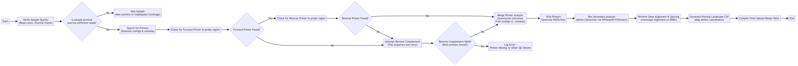

The Proviral Pipeline automatically transforms raw sequencing results into quality--controlled viral sequences with key defect annotations. This page provides a concise overview of the conceptual stages of the workflow.

## A. Sample Verification and Selection

- **Sequencing Depth Check:**
  The pipeline begins by reviewing each sample's sequencing depth (using MiCall cascade data) to decide whether it meets the minimum requirements.

- **Quality Filtering:**
  Samples with insufficient read counts or those that are clearly nonviral are automatically flagged and excluded from further processing. Find more details about filtering [here](filtering.html).

## B. Primer Analysis and Error Flagging

- **Detection of Primer Regions:**
  For every sample that passes initial verification, the pipeline examines the sequence ends to locate the lab--added primer regions.

- **Robust Alignment:**
  It uses robust alignment methods (even trying the reverse complement if necessary) to verify that both the forward and reverse primers are present.

- **Error Recording:**
  If the primer signals are weak, missing, or contain anomalies (for example, low coverage in the primer region or the presence of non--TCGA characters), the pipeline records specific error codes (see [Error codes](errors.html)). Separate primer analysis reports are generated for consensus sequences and assembled contigs (these are `conseqs_primers.csv` and `contigs_primers.csv` files from [interpretation page](interpretation.html)).

## C. Outcome Summarization and Quality Decision

- **Merging Primer Analysis:**
  Results from the primer analysis are merged into an overall "outcome summary" (the `outcome_summary.csv` file from [interpretation page](interpretation.html)) that indicates for each sample which sequence (if any) successfully passed quality control.

- **Conflict Resolution:**
  In cases where multiple sequences are available for a single sample, the pipeline flags conflicting results so that only the best candidate is used in subsequent steps.

## D. Primer Stripping and FASTA Generation

- **Primer Removal:**
  For samples with validated primer regions, the primers are "stripped" from the raw data to ensure that subsequent analyses focus solely on the viral genome.

- **FASTA File Production:**
  Cleaned sequences are then written to FASTA files (found in the `detailed_results.tar` file from [interpration page](interpretation.html)). In some cases, the pipeline augments sequences with synthetic primer sequences (to meet downstream tool requirements) and splits the results into multiple FASTA files when needed to manage resource usage.

## E. Secondary Analysis: Defect Detection and Prioritization

- **Invoking Secondary Tools:**
  The pipeline calls a secondary analysis module --- either HIVSeqinR or CFEIntact --- to screen the cleaned sequences for genetic defects such as deletions, hypermutation, or inversion events.

- **Defect Prioritization:**
  Detected defects are ordered by severity to identify the most critical anomaly for each sample (this is the `MyVerdict` field of `table_precursor.csv` file from [interpretation page](interpretation.html)). Detailed results of this stage are archived and later used for visualization and further review.

## F. Gene Alignment and Splicing

- **Alignment to Reference:**
  Independently of the defect detection, the primer-stripped sequences are aligned to a modified version of the standard HIV reference (HXB2).

- **Gene Extraction:**
  This alignment enables the pipeline to "splice out" individual viral genes (for example, gag, pol, env), which are saved in the `table_precursor.csv` file from the [interpretation page](interpretation.html). Soft--clipped regions are also assessed to ensure accurate definition of gene boundaries.

## G. Proviral Landscape Generation and Final Table Creation

- **Mapping Genomic Defects:**
  Using the defect analysis results, the pipeline creates a `proviral_landscape.csv` file that maps the genomic coordinates of each sample's viral fragments and highlights regions with critical defects (including any marked as inversions).

- **Comprehensive Output Table:**
  Finally, all the information --- a merging of the outcome summary, cleaned sequences, and gene annotations --- is compiled into an upload--ready summary table. This table allows you to quickly assess the overall quality and defect profile of your samples.

---

## Recap

The Proviral Pipeline automatically converts raw sequencing data into quality--controlled viral sequences. It highlights critical genetic defects (prioritized by severity) and produces easy--to--interpret summary reports and visualizations, enabling you to decide which samples are suitable for further analysis.

## Next Steps

For detailed descriptions of input formats, output interpretation, or troubleshooting issues, please refer to the relevant sections of the documentation (such as Data Preparation, Interpretation, and Troubleshooting).
